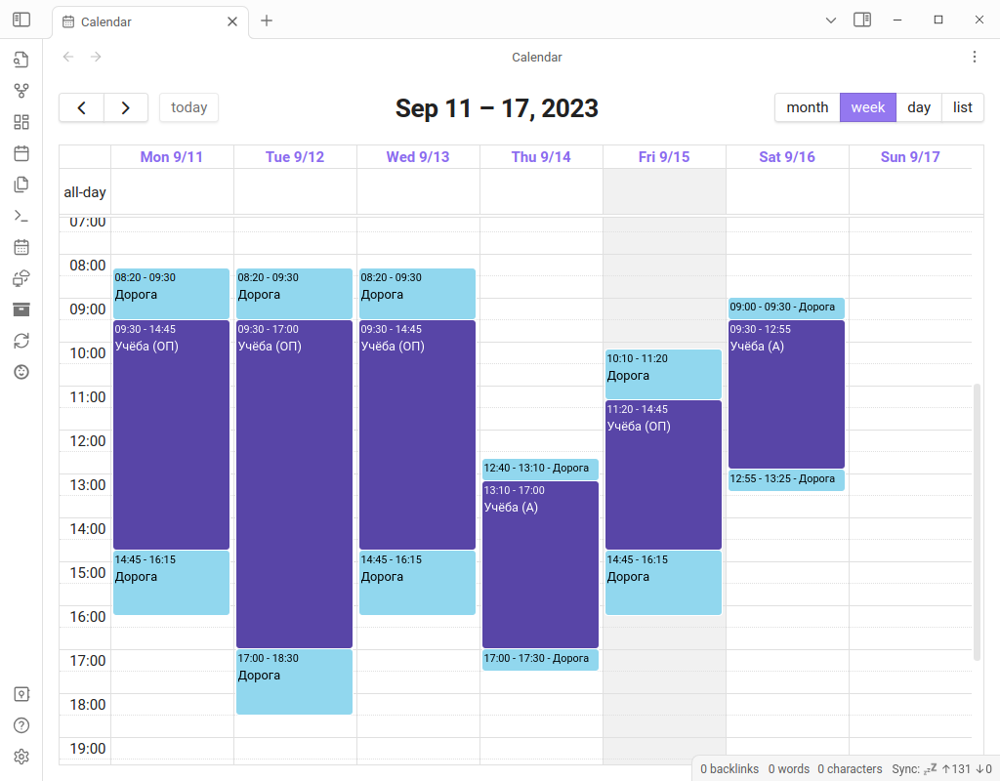
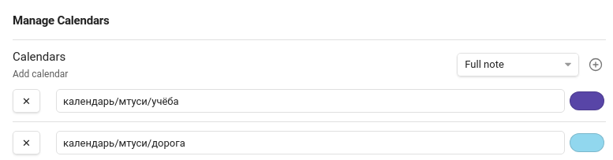

# Расписание МТУСИ в календаре Obsidian
Подгружает расписание занятий из API MTUCI/TECH в хранилище Obsidian.



## Установка
  1. Откройте хранилище Obsidian, в котором Вы собираетесь использовать этот
  плагин.
  2. Установите и включите плагины
  [BRAT](https://github.com/TfTHacker/obsidian42-brat) и
  [Full Calendar](https://github.com/davish/obsidian-full-calendar)
  3. При помощи BRAT установите этот плагин, указав репозиторий:
  `portasynthinca3/obsidianmd-mtuci-timetable`
  4. Включите этот плагин.

## Настройка
  1. Удостоверьтесь, что у Вас есть аккаунт [MTUCI/TECH](https://apimtuci.ru).
  Если Вы смотрите расписание в мини-приложении VK, Telegram-боте или на этом
  сайте, у Вас он есть.
  2. Скопируйте Ваш токен из [мини-приложения VK](https://apimtuci.ru/links/vk).
  3. Откройте настройки этого плагина и вставьте токен в соответствующее поле.
  4. Попробуйте [обновить расписание](#использование)
  5. Если всё прошло успешно, плагин сообщит об этом в сплывающем окошке, а в
  корне хранилища появится следующая структура (даты будут отличаться):
  ```
  календарь
  |
  \-- мтуси
      |
      |-- учёба
      |   |-- 2023-09-15
      |   |-- 2023-09-16
      |   | ...
      |   \-- 2023-09-29
      |
      \-- дорога
          |-- 2023-09-15-1
          |-- 2023-09-15-2
          | ...
          \-- 2023-09-29-2

  ```
  6. Настройте плагин Full Calendar, чтобы он отображал заметки из папок
  "учёба" и "дорога":\
  

## Использование
Нажмите кнопку  в левом вертикальном меню или
выполните команду "Расписание МТУСИ: Обновить расписание". В календаре
() создадутся или обновятся заметки,
соответствующие текущей и следующей неделе (если Вы уже настроили плагин Full
Calendar).

## Проблемы?
Откройте Issue в этом репозитории.
